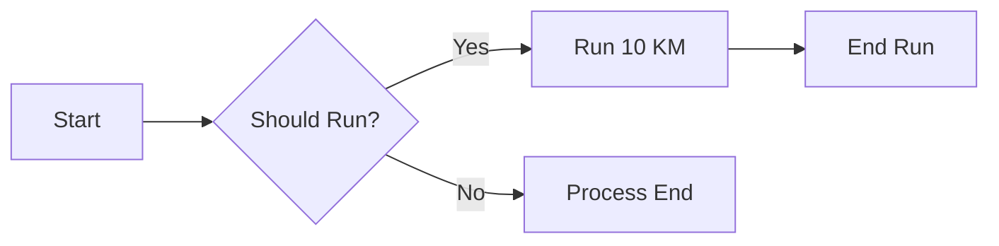
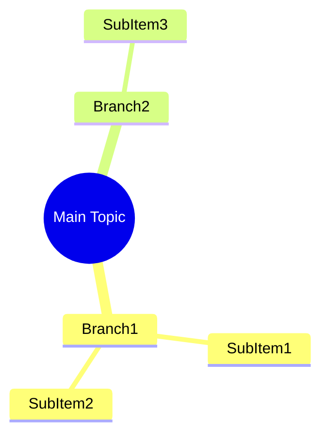
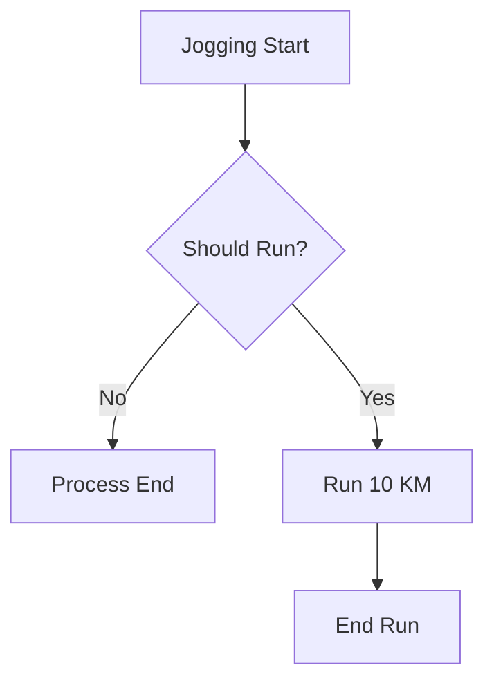

## 1. Introduction  
Draw.io (also known as diagrams.net) is a popular open-source diagramming tool that saves diagrams in an XML-based format ([DRAWIO - Diagram.net Diagram File Format](https://docs.fileformat.com/web/drawio/#:~:text=A%20file%20with%20a%20,HTML%20%20and%20%201378)). Mermaid, on the other hand, is a text-based diagram description language that uses a Markdown-inspired syntax to generate diagrams (flowcharts, UML diagrams, Gantt charts, etc.) from plain text ([Blog - Use Mermaid syntax to create diagrams](https://www.drawio.com/blog/mermaid-diagrams#:~:text=Mermaid%20is%20a%20syntax%20similar,inserted%20using%20the%20Mermaid%20syntax)). Both formats are open and text-based, but serve different use-cases: draw.io focuses on visual editing with precise layout, while Mermaid emphasizes **“diagrams as code”** for easy embedding in docs and version control ([Mermaid: A Better Way to Version Diagrams - DEV Community](https://dev.to/gallau/mermaid-a-better-way-to-version-diagrams-4ba0#:~:text=I%20recently%20joined%20a%20software,io)). Interoperability between these formats is important for developers and technical writers. It allows leveraging draw.io’s rich visual editing *and* Mermaid’s lightweight text representation – for example, one might sketch a complex process in draw.io and then convert it to Mermaid to embed in Markdown documentation or track changes in Git. The objective of this document is to outline a method to automatically convert draw.io diagrams into Mermaid diagrams using Python-based parsing. This will enable tool developers (and even AI models) to bridge the gap between the two, preserving as much diagram structure as possible during conversion.

*(Technical readers may skip the following note.)* **Technical Note:** By default, draw.io compresses the XML diagram data using a Deflate-based algorithm and encodes it in Base64 ([mxgraph - Format of Draw.io XML file? - Stack Overflow](https://stackoverflow.com/questions/59416025/format-of-draw-io-xml-file#:~:text=You%27re%20looking%20at%20the%20XML,prior%20to%20working%20with%20it)). This means the raw `<mxGraphModel>` XML is often stored as an unreadable string inside the `<diagram>` tag. For interoperability, it’s recommended to disable compression in draw.io (via *File → Properties → Disable compression*) so the file contains plain XML ([mxgraph - Format of Draw.io XML file? - Stack Overflow](https://stackoverflow.com/questions/59416025/format-of-draw-io-xml-file#:~:text=I%20know%20the%20question%20has,readable%20and%20easier%20to%20edit)). Otherwise, an extra step of Base64 decoding and decompression is required before parsing the XML.

In the rest of this document, we provide a technical overview of the draw.io file format and Mermaid syntax, then a mapping “rosetta stone” between draw.io XML elements and Mermaid constructs. We also outline a conversion algorithm (with Python pseudocode) and discuss handling various diagram types (flowcharts, mind maps, Gantt charts, etc.) and edge cases. Our aim is to equip you with the knowledge needed to implement an automated conversion tool and highlight potential pitfalls and future considerations.

## 2. Technical Overview of draw.io Format  
Draw.io diagram files (usually with extension `.drawio` or `.xml`) are essentially XML documents representing a graph model ([DRAWIO - Diagram.net Diagram File Format](https://docs.fileformat.com/web/drawio/#:~:text=DRAWIO%20files%20are%20vector%20image,Chrome%2C%20Firefox%2C%20Edge%20and%20Safari)). At the core is an `<mxGraphModel>` element which contains diagram metadata and a `<root>` element. The `<root>` holds a collection of `<mxCell>` elements, each representing a diagram object (node, edge, or group). The structure typically looks like: 

```xml
<mxGraphModel>
  <root>
    <mxCell id="0"/>
    <mxCell id="1" parent="0"/>
    <!-- actual diagram cells: vertices and edges -->
    <mxCell id="2" value="Start" style="ellipse;whiteSpace=wrap..." vertex="1" parent="1">
      <mxGeometry x="100" y="50" width="80" height="40" as="geometry"/>
    </mxCell>
    <mxCell id="3" value="End" style="rounded=1;whiteSpace=wrap..." vertex="1" parent="1">
      <mxGeometry x="400" y="50" width="80" height="40" as="geometry"/>
    </mxCell>
    <mxCell id="4" value="" style="edgeStyle=orthogonalEdgeStyle;endArrow=block;dashed=1;" edge="1" parent="1" source="2" target="3">
      <mxGeometry relative="1" as="geometry"/>
    </mxCell>
    <!-- ... -->
  </root>
</mxGraphModel>
``` 

In this snippet, `id="0"` and `id="1"` are special cells (the root and the first layer respectively, always present). The real content starts from `id="2"` onward. Key attributes of **mxCell** include ([mxCell](https://jgraph.github.io/mxgraph/docs/js-api/files/model/mxCell-js.html#:~:text=id%20Holds%20the%20Id,whether%20the%20cell%20is%20collapsed)) ([mxCell](https://jgraph.github.io/mxgraph/docs/js-api/files/model/mxCell-js.html#:~:text=visible%20Specifies%20whether%20the%20cell,not%20be%20cloned%20inside%20clone)):

- **id** – A unique identifier for the cell (draw.io often uses alphanumeric GUIDs, but in uncompressed examples you might see simple numbers). Other cells refer to this ID for relationships.  
- **value** – The text or label associated with the cell. This can be plain text (e.g. “Start”, “End”) or an HTML snippet if `style` enables HTML rendering. If a cell has no visible label, `value` may be an empty string.  
- **style** – A semicolon-separated list of style directives defining the appearance and shape. For example, `ellipse;whiteSpace=wrap;html=1;` defines an ellipse (oval) shape with text wrapping and HTML markup enabled in the label ([DRAWIO - Diagram.net Diagram File Format](https://docs.fileformat.com/web/drawio/#:~:text=%3CmxCell%20id%3D%22IQM8xkm7UoOLgGwT3,)). Styles control shape geometry (ellipse, rectangle, rhombus, etc.), colors, border, arrow styles, etc. (E.g. `rounded=1` might indicate a rectangle with rounded corners; `edgeStyle=orthogonalEdgeStyle` indicates an orthogonal routing for a connector.) If a shape has a named style (from a library), it may appear as a `stylename` in the style string.  
- **vertex** – If set to `"1"`, this cell is a **vertex** (node) in the graph ([mxCell](https://jgraph.github.io/mxgraph/docs/js-api/files/model/mxCell-js.html#:~:text=style%20Holds%20the%20style%20as,whether%20the%20cell%20is%20connectable)). Vertices are generally diagram shapes like process boxes, decision diamonds, etc. They typically have a corresponding `<mxGeometry>` child element (with `x`, `y`, `width`, `height`) defining their position and size on the canvas ([mxgraph - Format of Draw.io XML file? - Stack Overflow](https://stackoverflow.com/questions/59416025/format-of-draw-io-xml-file#:~:text=%3CmxGeometry%20width%3D,rounded%3D0%3BwhiteSpace%3Dwrap%3Bhtml%3D1%3Bshadow%3D1)).  
- **edge** – If set to `"1"`, this cell is an **edge** (connector) between vertices ([mxCell](https://jgraph.github.io/mxgraph/docs/js-api/files/model/mxCell-js.html#:~:text=style%20Holds%20the%20style%20as,whether%20the%20cell%20is%20collapsed)). Edge cells have attributes `source` and `target` pointing to the `id` of the source vertex and target vertex, respectively ([DRAWIO - Diagram.net Diagram File Format](https://docs.fileformat.com/web/drawio/#:~:text=%3CmxCell%20id%3D%22IQM8xkm7UoOLgGwT3,4%22%3E%20%3CmxGeometry%20relative%3D%221%22%20as%3D%22geometry%22)). Their `<mxGeometry>` usually has `relative="1"` (since the edge geometry is defined relative to connected nodes) and may contain child `<mxPoint>` elements for waypoints if the edge has manual routing points.  
- **parent** – The parent container of the cell. Draw.io uses a hierarchical model: for most top-level shapes, `parent="1"` (meaning they belong to the default layer cell with id 1). If a shape is contained within a group or swimlane, the parent will be the group cell’s id. The root cell (`id="0"`) is the ultimate ancestor of all.  
- **source / target** – (Edges only) References to the `id` of the source and target vertex of a connector ([mxCell](https://jgraph.github.io/mxgraph/docs/js-api/files/model/mxCell-js.html#:~:text=visible%20Specifies%20whether%20the%20cell,not%20be%20cloned%20inside%20clone)). These link the graph structure together.  
- **connectable / visible / collapsed** – Additional boolean flags (as `"0"` or `"1"`) that may appear in styles or as attributes. For example, `connectable="0"` can mark a shape as not allowing new connections, and `collapsed="1"` would indicate a group is collapsed (hiding its children).

Each `<mxCell>` may have an `<mxGeometry>` child node describing size and position. The geometry uses attributes: `x`, `y`, `width`, `height` for vertices ([DRAWIO - Diagram.net Diagram File Format](https://docs.fileformat.com/web/drawio/#:~:text=%3CmxCell%20id%3D%22IQM8xkm7UoOLgGwT3,)). For edges, geometry may include points or just have `relative="1"` with possibly an `<Array as="points">` of waypoints if the connector has bends. If a vertex is part of a group, its coordinates might be relative to the group’s origin.

For example, consider a simple flowchart in draw.io with a decision node. In the XML, you might see something like:

```xml
<mxCell id="5" value="Should Run?" style="rhombus;whiteSpace=wrap;html=1;" vertex="1" parent="1">
  <mxGeometry x="300" y="150" width="100" height="80" as="geometry"/>
</mxCell>
``` 

This corresponds to a diamond-shaped decision box with the label “Should Run?” ([DRAWIO - Diagram.net Diagram File Format](https://docs.fileformat.com/web/drawio/#:~:text=%3CmxCell%20id%3D%22IQM8xkm7UoOLgGwT3,)). Another example is an edge connecting nodes, e.g.:

```xml
<mxCell id="6" value="" style="edgeStyle=orthogonalEdgeStyle;endArrow=block;html=1;" edge="1" parent="1" source="2" target="5">
  <mxGeometry relative="1" as="geometry"/>
</mxCell>
``` 

This represents a connector (with an arrowhead) from cell `id="2"` to cell `id="5"`, orthogonally routed ([DRAWIO - Diagram.net Diagram File Format](https://docs.fileformat.com/web/drawio/#:~:text=%3CmxCell%20id%3D%22IQM8xkm7UoOLgGwT3,4%22%3E%20%3CmxGeometry%20relative%3D%221%22%20as%3D%22geometry%22)). The empty `value` means the connector has no text label.

It’s worth noting that draw.io’s XML can represent very rich visual information (precise coordinates, styles, colors, images, etc.), much of which might not have an equivalent in Mermaid’s simpler textual format. For instance, draw.io supports grouping of shapes (a group is just a vertex with `style="group"` or similar, acting as a container parent for other cells ([mxgraph - Format of Draw.io XML file? - Stack Overflow](https://stackoverflow.com/questions/59416025/format-of-draw-io-xml-file#:~:text=%3CmxCell%20id%3D,geometry))) and layers (multiple parent cells like id="1", id="2" as separate layers). These constructs have to be handled carefully (e.g., groups might become subgraphs in Mermaid, as we discuss later). 

Finally, a draw.io file can contain multiple `<diagram>` entries within an `<mxfile>` (for multi-page diagrams). Each `<diagram>` has its own `<mxGraphModel>`. A conversion tool should check if multiple diagrams are present and possibly handle each page separately.

## 3. Technical Overview of Mermaid  
Mermaid is a declarative diagramming DSL that allows users to write diagrams as text. Unlike draw.io, Mermaid doesn’t store explicit coordinates or detailed style info for each element – instead, you specify *what* nodes and connections exist, and Mermaid’s renderer auto-layouts the diagram. Mermaid supports a variety of diagram types, including **flowcharts, sequence diagrams, class diagrams, state diagrams, Gantt charts, pie charts, mind maps,** and more ([Mermaid: A Better Way to Version Diagrams - DEV Community](https://dev.to/gallau/mermaid-a-better-way-to-version-diagrams-4ba0#:~:text=Mermaid%20is%20a%20tool%20that,variety%20of%20code%20structures%2C%20including)). This versatility makes it a powerful tool for documenting systems and processes in a standardized way.

Mermaid syntax is designed to be human-readable. Diagrams are defined by a code block starting with a keyword indicating the type (e.g. `flowchart`, `sequenceDiagram`, `classDiagram`, `gantt`, `mindmap`, etc.). Within the diagram, nodes and relationships are specified in a concise manner. For example, a simple flowchart in Mermaid might be:



This describes a left-to-right flowchart (LR) where **A** is a start node, which leads into decision **B**, with two branches ("Yes" going to C and "No" going to D), and so on. Mermaid infers the layout and draws appropriate shapes for nodes based on the syntax. In the above example:  
- Nodes with text in square brackets like `A[Start]` are rectangular nodes labeled “Start”.  
- Text in curly braces like `B{Should Run?}` produces a diamond decision node.  
- The `-- Yes -->` notation means a labeled arrow with text "Yes" on it.  
- `-->` produces a normal arrow, whereas `-->` (with no text) is just an unlabeled arrow. Mermaid even allows different arrow styles (for example `-.->` would be a dashed line, and `---` a line without an arrowhead).

Mermaid flowcharts are composed of **nodes** and **edges (connections)** ([Flowcharts Syntax | Mermaid](https://mermaid.js.org/syntax/flowchart.html#:~:text=Flowcharts%20are%20composed%20of%20nodes,linking%20to%20and%20from%20subgraphs)). Nodes can be styled by using specific notations: by default `NodeName[Text]` gives a rectangle, but other shapes are possible by changing the bracket syntax ([Blog - Use Mermaid syntax to create diagrams](https://www.drawio.com/blog/mermaid-diagrams#:~:text=Shape%20styles%20%60,flowchart)). Common shape markers include:  

- `[Text]` for a **rectangle** node (sharp corners).  
- `(Text)` for a **rounded rectangle** (sometimes rendered as a stadium shape).  
- `((Text))` for a **circle/ellipse** node (often used for start/end or terminals).  
- `{Text}` for a **rhombus** (diamond decision node).  
- `>Text]` or `]Text[>` can denote subroutines or special shapes (Mermaid has additional syntax for more shapes, and recent versions added support for icons and advanced shapes, but these are beyond the basics).  

Edges in Mermaid are specified by arrow syntax between node identifiers. For example: `A --> B` means a directed arrow from A to B. Variants like `A --- B` (no arrowhead line) or `A -.-> B` (dashed arrow) allow styling connectors. You can add an arrow label using the `|label|` notation in the middle of an arrow ([Blog - Use Mermaid syntax to create diagrams](https://www.drawio.com/blog/mermaid-diagrams#:~:text=Shape%20styles%20%60,flowchart)). Mermaid automatically handles arrow routing and avoids overlaps, so unlike draw.io, you don’t manually specify waypoints.

Each diagram type in Mermaid has its own specialized syntax beyond flowcharts. For instance:
- **Sequence diagrams** (declared with `sequenceDiagram`) describe interactions over time. You list actors/participants and use arrows like `Actor A->>Actor B: Message` to show messages ([Getting Started with Mermaid for Diagramming and Charting | InfluxData](https://www.influxdata.com/blog/getting-started-mermaidjs-diagramming-charting/#:~:text=two%20participants%2C%20Brian%20and%20Ken)). Mermaid handles the lifeline layout and ordering based on the code order.
- **Gantt charts** (`gantt` keyword) allow specifying tasks with start dates or durations and automatically generate timeline bars ([Gantt diagrams | Mermaid](https://mermaid.js.org/syntax/gantt.html#:~:text=,summary%20elements%20of%20a%20project)) ([Gantt diagrams | Mermaid](https://mermaid.js.org/syntax/gantt.html#:~:text=Mermaid%20can%20render%20Gantt%20diagrams,can%20be%20pasted%20into%20docs)).
- **Class diagrams** (`classDiagram`) let you declare classes, their members, and relationships (inheritance or association).
- **State diagrams** (`stateDiagram`) represent state machines with states and transitions.
- **Mind maps** (`mindmap`) use indentation to build a hierarchical set of nodes (Mermaid’s mindmap feature is relatively new and experimental ([Mindmap | Mermaid](https://mermaid.js.org/syntax/mindmap.html#:~:text=,which%20is%20the%20experimental%20part)), mirroring how a central concept branches into sub-ideas).

**Limitations and differences:** Because Mermaid’s philosophy is “less is more” for input, it does not (by default) preserve exact visual layouts from input. You cannot specify exact x/y coordinates for nodes – you can only hint at flow direction (top-down, left-right, etc.) and groupings (like subgraphs). This means information like pixel-perfect positions or custom styling (colors, fonts) in draw.io cannot be carried over 1:1. Mermaid does support some styling via CSS classes or directives, but it’s relatively limited compared to draw.io’s per-shape style options. Additionally, Mermaid has no direct concept of layers or swimlanes (though one can simulate swimlanes with subgraphs or by splitting a flowchart). Some complex draw.io shape types (e.g. detailed BPMN symbols or icon-based shapes) might not have built-in equivalents in Mermaid. 

Despite these differences, the core structural information – **which nodes, with what labels, connected to whom** – *can* be mapped from draw.io to Mermaid. The next section provides a mapping guide aligning draw.io XML elements to Mermaid syntax.

## 4. Mapping Guide: draw.io XML to Mermaid  
Converting a draw.io diagram to Mermaid involves mapping the structural elements of the diagram to Mermaid’s syntax. The following is a mapping “Rosetta Stone” aligning key draw.io constructs with Mermaid equivalents:

- **Vertices (Nodes):** Each `<mxCell>` with `vertex="1"` corresponds to a node in Mermaid. The cell’s `value` becomes the node’s label text, and the `style` determines the node’s shape or type. For example, a draw.io vertex with style containing `ellipse` (or an elliptical shape) would map to a Mermaid circular node using double parentheses `((Label))`. A rectangular process box (the default shape in draw.io if not otherwise specified) would map to a Mermaid rectangle, e.g. `[Label]`. A decision diamond (draw.io style `rhombus` or a shape with that name) maps to a Mermaid decision node `{Label}`. Table 1 below summarizes some shape mappings:

  | Draw.io Shape Style                   | Mermaid Node Syntax        | Mermaid Shape      |
  |---------------------------------------|----------------------------|--------------------|
  | Rectangle (default)                   | `NodeID[Text]`             | Rectangle (square corners) |
  | Rectangle (rounded corners)           | `NodeID(Text)`             | Rounded rectangle (“stadium”) |
  | Circle / Ellipse                      | `NodeID((Text))`           | Circle / Ellipse   |
  | Diamond (decision rhombus)            | `NodeID{Text}`             | Decision (diamond) |
  | Cloud, Hexagon, etc. (no direct built-in) | `NodeID[Text]` (fallback) | (Use rectangle or closest shape) |
  | Group container (swimlane, group)     | *Subgraph* (see below)     | Cluster grouping   |

  *Table 1: Mapping of common draw.io shapes to Mermaid node syntax.*  

  In most cases, the draw.io `style` string will contain clues to the shape: e.g. `shape=ellipse` or simply `ellipse;...` indicates an ellipse, `rhombus` indicates a diamond, `rounded=1` on a rectangle indicates use of a rounded box in draw.io (which we can map to `(...)` syntax in Mermaid). If a draw.io shape doesn’t have a direct Mermaid counterpart (for example, a cloud icon or a complex UML shape), the converter may have to default to a generic node. The content of the node (the label) can still be carried over, even if the exact appearance isn’t reproduced. In practice, preserving the label text is the most important part for understanding.

- **Edges (Connectors):** Each `<mxCell>` with `edge="1"` becomes a connection in Mermaid. The `source` and `target` attributes of the mxCell tell us which nodes to connect. For example, an edge cell with `source="2"` and `target="5"` means an arrow from the node with id 2 to the node with id 5. In Mermaid, if those nodes were given identifiers or aliases, we would output something like `Node2ID --> Node5ID`. Often, we can use the nodes’ labels or a generated ID as Mermaid node identifiers. 

  If the edge `<mxCell>` has a non-empty `value` (meaning the connector has a text label in draw.io), this should be mapped to a Mermaid edge label. Mermaid syntax for an edge label is `A --|label|--> B` (for a directional arrow with text) or `A ---|label|--- B` (for an unlabeled line with text, though unlabeled lines are rare). For a directional arrow with label, `A -- label --> B` is also accepted ([Blog - Use Mermaid syntax to create diagrams](https://www.drawio.com/blog/mermaid-diagrams#:~:text=Shape%20styles%20%60,flowchart)). For example, if a draw.io connector has `value="Yes"`, we would produce something like `A -- "Yes" --> B` in Mermaid (quotes around the label are recommended especially if it contains spaces or special characters).

  We also consider edge styles: draw.io’s `style` for edges might indicate if it’s dashed (`dashed=1`) or the arrowhead style (`endArrow=none` for no arrow, etc.). A robust converter could map a dashed style to a Mermaid dashed line (`-.->`) and an `endArrow=none` to a Mermaid line without arrow (`---`). For instance, a draw.io line with no arrowheads at either end would be represented as `A --- B` in Mermaid. Similarly, an edge marked as bidirectional (arrows at both ends) might be approximated by two Mermaid arrows in opposite directions (Mermaid doesn’t have a single line with two arrowheads by default). Such style mappings ensure the semantics (dashed vs solid, arrow vs no arrow) are preserved where Mermaid supports it.

- **Node Identifiers:** In Mermaid code, each node is referenced by an identifier. We have a choice: we could use the draw.io cell IDs (like “IQM8xkm7...” or “5”) as Mermaid node IDs, but these are usually not human-friendly. Instead, the converter might generate simple IDs based on the node’s label or type (e.g., `Start`, `ProcessEnd`, `Decision1` etc.). The Mermaid node syntax allows us to separate the internal ID from the displayed text. For example, `processEnd[Process End]` defines a node with ID “processEnd” and visible label “Process End”. We can leverage this by creating safe IDs (alphanumeric, no spaces) for each node. If two draw.io nodes have identical labels, we’d need to uniquify the IDs (e.g., append an index) to avoid clashes in Mermaid.

- **Groups and Containers:** Draw.io allows grouping elements (e.g., using a “group” or “swimlane” shape). These appear as a parent-child relationship in the XML (a group cell is a vertex whose child cells have `parent` set to that group’s id). Mermaid has the notion of **subgraphs** (for flowcharts) which can cluster nodes together under a name. A conversion strategy is: if a draw.io vertex is purely a container (e.g., style indicates a group or swimlane, and it contains other vertices), we can output a Mermaid subgraph. For example, a group with `value="Subsystem A"` that contains nodes 5,6,7 could be converted as: 
  ```
  subgraph Subsystem_A["Subsystem A"]
      Node5[...]
      Node6[...]
      Node7[...]
  end
  ``` 
  This will visually group those nodes together in the Mermaid flowchart, roughly analogous to the grouping in draw.io. Note that Mermaid’s subgraphs are primarily for grouping in flowcharts; they won’t exactly reproduce a swimlane layout, but they do provide a visual boundary with a title. If the group is a **swimlane** (common in flowcharts to separate responsibilities), one could treat each swimlane as a subgraph or simply prefix node labels with the lane name. (We discuss swimlanes more in the examples section.)

- **Geometry and Positioning:** Draw.io coordinates (x, y) generally won’t be used in the Mermaid output, because Mermaid auto-layouts the diagram. However, relative positioning might imply an order or flow direction. For instance, in a flowchart drawn left-to-right in draw.io, you might set the Mermaid direction to left-right (`graph LR`) to better match the original layout intent. If the draw.io diagram is top-down, use `graph TD` (top-down). A converter could guess the orientation: e.g., by comparing the spread of x vs y coordinates of nodes to decide “LR” vs “TB” (top-bottom). This is a heuristic; the user can always adjust the orientation in the Mermaid code later.

- **Special draw.io elements:** Some diagrams have extras like text annotations (stand-alone labels not attached to any shape) or images. A stand-alone text label in draw.io (an `<mxCell>` with vertex="1" but perhaps a style indicating it’s just text with no border) has no direct Mermaid equivalent except possibly as a node or note. Mermaid sequence diagrams and flowcharts support little text notes (e.g., `Note right of A: text` in sequence diagrams), but implementing conversion for all such cases can be complex. For a first-pass tool, one might ignore free-floating text or treat it as a node with no shape. Images in draw.io similarly have no equivalent in Mermaid (except maybe using an icon or class with a link, which is advanced), so those could be skipped or replaced with a label like “[Image]”.

- **Diagram type differences:** It’s crucial to detect or decide which Mermaid diagram type to output. For most flowcharts, `flowchart` is appropriate. But if the draw.io diagram looks like a sequence diagram or a timeline, it might be better to output Mermaid `sequenceDiagram` or `gantt`. In many cases, draw.io doesn’t explicitly encode the “type” of diagram – it’s just shapes and lines. So the converter might default to a flowchart for general connected graphs. Only if certain patterns are recognized (e.g., lifeline swimlane shapes for sequence, or a time-axis with bars for a Gantt) would it switch output type. In Section 6, we will discuss diagram-specific considerations for mapping to the correct Mermaid syntax.

In summary, the mapping involves **identifying nodes, determining their shape and label, identifying connections, grouping if needed, and then emitting Mermaid syntax** that captures that structure. We have to be mindful of Mermaid’s reserved keywords (for example, a node text of "end" cannot be used plainly as it conflicts with the `end` keyword in flowcharts ([Flowcharts Syntax | Mermaid](https://mermaid.js.org/syntax/flowchart.html#:~:text=WARNING)); we would alter it or quote it). The next section will outline an algorithm and Python approach to implement this mapping.

## 5. Conversion Algorithm and Python Implementation  
Converting draw.io XML to Mermaid can be achieved with a step-by-step algorithm. Below is a high-level breakdown of the conversion process, followed by notes on a Python implementation:

**Step-by-Step Conversion Methodology:**  

1. **Input Handling:** Load the draw.io `.drawio` file or XML string. If the content is compressed (embedded as base64 within `<diagram>`), decode the base64 text and decompress it (draw.io uses a raw deflate compression without header ([mxgraph - Format of Draw.io XML file? - Stack Overflow](https://stackoverflow.com/questions/59416025/format-of-draw-io-xml-file#:~:text=You%27re%20looking%20at%20the%20XML,prior%20to%20working%20with%20it))). This will yield the plain XML `<mxGraphModel>` data. In Python, you can identify compressed data if it contains many non-XML characters; otherwise, if the file already contains `<mxGraphModel>` tags, it’s uncompressed.

2. **XML Parsing:** Parse the XML into a DOM or tree structure. Python’s built-in `xml.etree.ElementTree` is sufficient for this. For safety, one may use `defusedxml` to avoid any potential XML vulnerabilities if processing untrusted files. Locate the `<root>` element within `<mxGraphModel>`. (If the file is an `<mxfile>` with multiple `<diagram>` elements, iterate through each diagram.)

3. **Extract Vertices and Edges:** Iterate over all `<mxCell>` elements in the root. For each cell:
   - If it has attribute `vertex="1"` (and typically not `edge="1"`), treat it as a node. Collect its `id`, `value` (label), and `style`. 
   - If it has `edge="1"`, treat it as an edge. Note its `source` and `target` references, and also capture its `value` (label) if present, and possibly style (for dashed/arrow info).

   Cells with `id="0"` or `id="1"` (and any other purely structural cells like layers) can be ignored for content purposes.

4. **Build Node Map:** Create a dictionary or map to hold node information. For each vertex cell, determine a suitable Mermaid node identifier and shape: 
   - **Identifier:** You could use the cell’s `id` directly, but as discussed, a name based on the `value` is nicer. For example, if `value="Start Process"`, make an ID like `start_process` (lowercase, spaces to underscore, etc.). Ensure uniqueness (e.g., keep a set of used IDs, append a number if there’s a clash). If `value` is empty, you might use a generic name like `node123` (using the cell’s numeric ID or a running index).
   - **Shape:** Examine the style string to decide Mermaid syntax. Pseudocode:
     ```python
     style = cell.get("style", "")
     if "rhombus" in style or "shape=rhombus" in style:
         mermaid_node_def = f'{id}{{{label}}}'    # diamond
     elif "ellipse" in style or "shape=ellipse" in style:
         mermaid_node_def = f'{id}(({label}))'    # circle
     elif "rounded=1" in style or "shape=stadium" in style:
         mermaid_node_def = f'{id}({label})'      # rounded rectangle
     else:
         mermaid_node_def = f'{id}[{label}]'      # default rectangle
     ```
     (This is a simplification; a real implementation might need to parse style semicolon tokens more robustly.)

     Also, ensure the `label` is properly escaped/quoted. If the label contains characters like `]` or `"` that could confuse Mermaid, wrap it in quotes inside the brackets, e.g. `id["My label with ] bracket"]`.

   Store in the node map: `node_map[cell_id] = node_definition_string`. Also keep track of mapping from old `id` to new Mermaid ID (especially if we generated a new ID) so that edges can reference the new IDs.

5. **Handle Groups/Subgraphs:** Detect if any vertex cells represent containers/groups. Heuristic: a vertex with style indicating `group` or `swimlane`, or a vertex with children (i.e., other cells have parent = this cell’s id) likely represents a grouping. Mark those and the list of member nodes. We might not want to output a Mermaid node for the group itself (since it’s not a real node, it’s a container). Instead, plan to output a `subgraph`. For each such group:
   - Determine the group label (from `value`) or assign a generic one if none.
   - All member nodes will be listed inside the subgraph in the Mermaid output, and we will not list them separately at top level.

   You can identify child relations by scanning the vertices: e.g., build `children_of = {parent_id: [child_ids...]}` from the cells. Then any parent that corresponds to a group shape, we’ll treat accordingly.

6. **Construct Mermaid Output:** Start assembling the Mermaid diagram text. For a generic diagram, we might default to a flowchart. For flowcharts, decide direction (`TB` or `LR`). As mentioned, a simple approach is to check the bounding box of all nodes: if width > height, choose LR, else TB. Or allow the user to specify as a parameter.

   Begin the Mermaid code with the diagram type line, e.g., 
   ``` 
   flowchart LR 
   ``` 
   (or `flowchart TB`). If you identified a diagram as a different type, output that keyword instead (we’ll cover special cases in Section 6).

   Then, output node definitions. If using subgraphs:
    ``` 
    subgraph GroupLabel
        Member1[...] 
        Member2(...)
    end
    ``` 
   for each group. Nodes that are not in any group can be output directly as `ID[Label]` lines. Typically, Mermaid doesn’t require listing nodes before connecting them – you can introduce them on the fly in the connections – but listing them can be useful for clarity or if a node has no incoming/outgoing edges (isolated node).

   Next, output the edges. For each edge from the earlier extraction:
    - Find the `source` cell’s new Mermaid ID (from your node map) and the `target` cell’s new ID.
    - Determine arrow style: by default use `-->`. If the style string of the edge has `dashed` or similar, use `-.->`. If no arrow (maybe `endArrow=none` and `startArrow=none` in style), use `---`. If the edge is undirected or double-headed, you might represent it as two separate arrows (A --> B and B --> A) because Mermaid flowcharts don’t have a built-in undirected line.
    - If there is an edge label (value), include it. e.g. `A -- "label text" --> B`.

    For example, using our earlier mapping:
    ``` 
    A[Start] --> B{Should Run?}
    B -->|Yes| C[Run 10 KM]
    B -->|No| D[Process End]
    C --> E[End Run]
    ```
    This reflects edges from Start to Decision, Decision to Run (Yes branch), Decision to End (No branch), etc., with labels on the branches.

7. **Post-processing and Output:** Ensure the Mermaid text is properly formatted. It’s good to trim any overly long labels or remove newlines in labels (draw.io text can include newlines or HTML <br>; Mermaid can support some multiline or styled text with special syntax, but a first version can simplify multiline text to a single line or separate node). Also, avoid Mermaid reserved words: for instance, if a node ID or label turned out to be "end" or "graph" or "flowchart", rename or quote it, since those could break the syntax. After these adjustments, the final Mermaid markdown can be output to a file or returned as a string.

**Pseudocode Example (Pythonic):**  
```python
import base64, zlib, xml.etree.ElementTree as ET

def drawio_to_mermaid(xml_data):
    # 1. Check for compression (simple check for mxGraphModel tag)
    if "<mxGraphModel" not in xml_data:
        # assume compressed content inside <diagram>
        # extract text between <diagram> tags
        start = xml_data.find(">") + 1
        end = xml_data.rfind("<")
        compressed_text = xml_data[start:end]
        decoded = base64.b64decode(compressed_text)
        xml_data = zlib.decompress(decoded, -15).decode('utf-8')  # -15 for raw deflate
    
    # 2. Parse XML
    tree = ET.fromstring(xml_data)
    root = tree.find("root")
    if root is None:
        raise ValueError("No root found in draw.io XML")
    
    # 3. classify cells
    nodes = {}
    edges = []
    children_map = {}
    for cell in root.findall("mxCell"):
        id = cell.get("id")
        parent_id = cell.get("parent")
        # build children mapping
        if parent_id:
            children_map.setdefault(parent_id, []).append(id)
        if cell.get("vertex") == "1":
            # store node info
            value = cell.get("value") or ""
            style = cell.get("style") or ""
            nodes[id] = {"label": value, "style": style, "children": children_map.get(id, [])}
        elif cell.get("edge") == "1":
            edges.append({
                "source": cell.get("source"),
                "target": cell.get("target"),
                "label": cell.get("value") or "",
                "style": cell.get("style") or ""
            })
    
    # 4. Determine diagram orientation (optional)
    direction = "TB"
    # (Compute bounding box of nodes if coordinates are present in mxGeometry to set LR vs TB)
    
    # Start building Mermaid text
    mermaid_lines = [f"flowchart {direction}"]
    
    # 5. Output subgraphs for groups (if any)
    handled_nodes = set()
    for node_id, info in nodes.items():
        # identify group containers: those with a 'group' in style or swimlane, etc., and having children
        if "group" in info["style"] or "swimlane" in info["style"] or info["children"]:
            # treat as subgraph if it has children shapes
            if info["children"]:
                label = info["label"] or f"Group_{node_id}"
                mermaid_lines.append(f"subgraph {node_id}[{label}]")
                # output each child node within
                for child_id in info["children"]:
                    if child_id in nodes:
                        child_def = format_node(child_id, nodes[child_id])  # using a helper to format shape
                        mermaid_lines.append("    " + child_def)
                        handled_nodes.add(child_id)
                mermaid_lines.append("end")
                handled_nodes.add(node_id)
            # else: if group has no children, we might ignore it
    
    # 6. Output remaining nodes (not handled by groups)
    for node_id, info in nodes.items():
        if node_id in handled_nodes:
            continue
        node_def = format_node(node_id, info)
        mermaid_lines.append(node_def)
    
    # 7. Output edges
    for edge in edges:
        src_id = edge["source"]; tgt_id = edge["target"]
        if not src_id or not tgt_id:
            continue  # skip edges with missing endpoints
        # skip if connecting to a group container itself, which Mermaid cannot represent directly
        if nodes.get(src_id, {}).get("children") or nodes.get(tgt_id, {}).get("children"):
            # Possibly handle as needed (e.g., connect to a subgraph node?), but for simplicity skip.
            pass
        # Determine arrow
        arrow = "-->"
        if "dashed=1" in edge["style"] or "dashed" in edge["style"]:
            arrow = "-.->"
        if "endArrow=none" in edge["style"]:
            arrow = arrow.replace("->", "-")  # remove arrowhead
        label = edge["label"]
        if label:
            mermaid_lines.append(f"{src_id} -- \"{label}\" {arrow} {tgt_id}")
        else:
            mermaid_lines.append(f"{src_id} {arrow} {tgt_id}")
    
    return "\n".join(mermaid_lines)
```

In the above pseudocode, `format_node` would implement the shape mapping logic (checking style for `rhombus`, `ellipse`, etc., and producing a string like `id[Label]`). The pseudocode focuses on flowcharts; sequence or other diagrams would require a different approach (see Section 6). Also note the handling for groups: we output subgraphs and mark those nodes as handled. The edge handling should avoid linking to group container IDs since Mermaid can’t draw an arrow to a cluster as a whole (if an edge connects to a group, you might instead connect it to a specific node inside or ignore it – usually draw.io groups don’t have their own incoming/outgoing connectors, except swimlane borders which we can ignore).

**Libraries and Frameworks:** The implementation can be done with pure Python standard libraries (xml.etree for parsing, maybe `re` for style parsing). If performance or complexity grows, consider using libraries:
- `xmltodict` (to easily convert XML to Python dicts).
- Graph libraries like `networkx` (to manage the graph structure) – not strictly necessary, but could help if doing analysis like topological sorting or component detection in the diagram.
- Mermaid doesn’t have an official Python generation library (since its syntax is simple text), but you could use templates or f-strings to build the output. Some community projects or the Mermaid CLI (if installed via Node) can be invoked to render or validate the output, but for conversion, we just need to produce text.

**Handling Special Cases in Code:** The algorithm should account for things like:
- Edges where source/target is missing (skip them – possibly a dangling connector).
- Multiple edges between the same two nodes (Mermaid will draw parallel arrows by default; that’s usually fine).
- Self-loops (edge source == target): Mermaid flowcharts can depict a self-loop arrow, but it won’t be pretty. We can still output `A --> A` or `A --label--> A` and Mermaid will attempt a loop.
- If the draw.io diagram is actually a different type (say, a UML class diagram drawn with boxes and connecting lines), the converter might mis-identify it as a flowchart. This is a limitation; one could add detection (e.g., if many lines have no arrowheads and connect class-shaped rectangles, perhaps treat it as a class diagram in Mermaid). In such a case, the mapping rules would differ (Mermaid class diagrams expect `ClassName --|> SuperClass` for inheritance, etc.). This document focuses on flowchart-like conversions, but extensibility is discussed later.

**Verification:** After conversion, it’s good practice to run the output through a Mermaid renderer or linter to ensure it’s valid. The Mermaid CLI (installed via Node.js) can take the text and output an SVG/PNG, which can be used to visually verify the structure matches the original diagram. In an automated tool, this could be part of a test suite (with sample diagrams).

With the algorithm in hand, we can now explore how it applies to specific diagram types and edge cases, and how to refine conversion for them.

## 6. Diagram-Specific Examples & Edge Cases  

Every diagram type comes with unique challenges when converting from draw.io to Mermaid. In this section, we walk through several examples and discuss handling of each:

### Gantt Charts  
 ([Creating Gantt Charts with Markdown and Mermaid.js](https://newdevsguide.com/2023/04/14/mermaid-gantt-chart/)) *Example: A simple Gantt chart defined in Mermaid, showing tasks over days.* Gantt charts in Mermaid are created using a specialized syntax under the `gantt` keyword, where each task is listed with start and end or duration ([Creating Gantt Charts with Markdown and Mermaid.js](https://newdevsguide.com/2023/04/14/mermaid-gantt-chart/#:~:text=gantt%20title%20Write%20about%20Mermaid,14%2C%201d)). Draw.io does not have a native Gantt chart object – users might create something that visually resembles a Gantt chart (e.g., a timeline with colored bars and labels), but it’s essentially a collection of rectangles and text in the draw.io XML, not an explicit “task list.” This makes automated conversion to a semantic Gantt chart difficult. 

If a draw.io diagram is clearly a Gantt (maybe the user used a Gantt template or arranged shapes in a timeline format), a converter would need to infer task start dates and durations from the positions of bars – a highly non-trivial task. For instance, if the diagram has a date axis and each task bar’s left/right alignment corresponds to dates, one would have to read text labels as dates or measure pixel distances. That veers into image/graph interpretation more than direct file conversion.

**Practical approach:** Unless the draw.io file encodes the Gantt data in an easily parseable way (e.g., each bar shape’s label contains the date/duration), one might choose not to attempt full Gantt conversion. Instead, the tool could either skip these, or output a Mermaid Gantt with placeholders. For example, if task names are identifiable (text on the left) and maybe duration text is present, one could output those names as tasks in Mermaid but with arbitrary or sequential dates. The user would then adjust the dates. 

**Edge Case:** It’s possible to embed a Mermaid Gantt in draw.io using the Mermaid plugin (meaning the draw.io diagram itself has no bars, just one shape that contains Mermaid code). In such a case, conversion is moot – it’s already Mermaid code inside. But if someone did that, they probably wouldn’t need our converter. 

In summary, *conversion of a true timeline Gantt drawn in draw.io requires advanced interpretation and is likely out of scope for an automated tool*. The recommendation would be to handle it semi-automatically or advise the user to manually specify Gantt tasks in Mermaid after converting the basic layout.

### Application & Systems Architecture Diagrams  
Architecture diagrams (application architecture, system infrastructure, etc.) are typically drawn as boxes representing components (servers, databases, services) with connections (network links, data flows) between them. In draw.io, these might include a lot of iconography (e.g., cloud symbols for cloud services, cylinder shapes for databases, etc.) and sometimes groupings like network zones or tiers.

For conversion:
- The structural part (components and connections) can be mapped to a **flowchart** in Mermaid. Each component can be a node, possibly with an appropriate shape: e.g., a database cylinder in draw.io could be represented as a Mermaid node with a `[/]` style (Mermaid has a shorthand for database as `([])`, although in newer Mermaid versions there are more explicit shapes like `:::database` class). If sticking to core syntax, we might just use `[DB Name]` or `((DB Name))` to indicate a database.
- **Grouping by tiers:** If the draw.io architecture diagram has a legend or boundary box grouping components (like a dotted rectangle around “DMZ network” vs “Internal network”), those could become Mermaid subgraphs with the group name as title. This won’t exactly match a fancy background box but will logically group them in the Mermaid output.
- **Icons:** Obviously Mermaid won’t embed the actual icons. But perhaps the node label can include an emoji or text to hint (some Mermaid integrators allow using font-awesome icons via syntax like `:::icon(fa-database)` if configured ([Mindmap | Mermaid](https://mermaid.js.org/syntax/mindmap.html#:~:text=Icons%20and%20classes)), but that’s advanced). For a straightforward converter, we’d replace an icon shape with a text label of what it represents. For example, a draw.io AWS icon for “EC2” might have no text, just the icon; we would output a node like `[EC2]` or `[Server]` based on context (maybe using the shape’s metadata or the fact it’s in a group labeled “Web Tier”). This requires some heuristics or a mapping table of common icon shapes to text.

Mermaid doesn’t have a dedicated “architecture diagram” type, so flowchart is the default choice. In some cases, a **class diagram** could be co-opted if the architecture is showing relationships like a component hierarchy or data model. But generally, flowchart with nodes and edges (possibly using descriptive edge labels like “HTTPS” or “SQL query”) is flexible enough.

**Edge Cases:**  
- If the diagram is very large or complex, Mermaid’s auto layout might jumble it. The converter might need to split it into multiple subgraphs or allow the user to rearrange after. It’s important to communicate that the conversion captures elements and links, but not the exact layout – so a nicely spaced draw.io network diagram might come out quite differently in Mermaid until manually adjusted.
- **Two-dimensional positioning:** Some architecture diagrams use a grid (like a matrix: e.g., layers vs tiers). Mermaid flowchart might not preserve the grid arrangement (it tends to do a hierarchical layout). There’s not a straightforward solution except to manually adjust or perhaps use Mermaid’s newer **grid or gantt** layouts in creative ways (Mermaid has a beta “grid” or “matrix” diagram type as of recent updates, but it’s not mainstream).

In conclusion, application and system architecture diagrams can be converted at the structural level: components become nodes, connections become arrows, groups become subgraphs. The main loss is visual styling (icons, exact placement). The converted Mermaid diagram will still convey the architecture logically, and could be further touched up by the user. This interoperability means an architect could initially sketch in draw.io and then include the diagram in a Markdown/MDX document via Mermaid by converting it.

### Mind Maps  
 ([Using Mermaid for Mindmaps in Microsoft Loop · CloudAppie
](https://www.cloudappie.nl/loop-mermaid-mindmap/)) *Example: Mermaid mind map code (top) and the rendered mind map (bottom) for a blog planning.* Mind maps are hierarchical diagrams centered on a single concept. In draw.io, a mind map might be drawn as a tree: one central node with branches out to sub-nodes, which in turn branch out, and so on. Typically, each connection in a mind map is a straightforward parent-child relationship (often drawn without arrowheads, just lines).

Mermaid introduced a **mindmap** syntax ([Mindmap | Mermaid](https://mermaid.js.org/syntax/mindmap.html#:~:text=The%20syntax%20for%20creating%20Mindmaps,the%20levels%20in%20the%20hierarchy)) that is perfectly suited for this scenario. The syntax relies on indentation to represent hierarchy. For example: 

This would render a mind map with “Main Topic” in the center, with two branches, etc. The double parentheses on Root make it a big bubble, and indented lines form the tree.

To convert a draw.io mind map:
- Identify the central node: likely the one with no incoming connectors (and possibly at the center of canvas). In XML terms, find the vertex with no other cell pointing to it as target. That’s the root of the mind map.
- Construct a tree data structure by following edges: each edge from topic A to topic B can be seen as A -> B in the mind map (the direction might not matter since mind map lines usually aren’t directed). If draw.io used arrows, the arrow probably points outward from the center.
- Perform a traversal from the root to build the hierarchy. Because the mind map is a tree, there shouldn’t be cycles. A simple DFS or BFS can assign levels to each node.
- Output in Mermaid mindmap format: start with `mindmap` keyword, then indent according to depth. The root node can be given using the special double-circle syntax `root((Root Label))` to emphasize it (Mermaid by default might just put it in a circle; using `(( ))` ensures a nice central circle).
- Mermaid mindmap supports different shapes for nodes too (similar to flowchart) ([Mindmap | Mermaid](https://mermaid.js.org/syntax/mindmap.html#:~:text=Mermaid%20mindmaps%20can%20show%20nodes,all%20supported%20from%20the%20start)), but you can largely stick to default or use shape indicators if the draw.io map had some distinction (not common in mind maps; usually all nodes are just text bubbles).

One has to be careful that Mermaid’s mindmap feature is relatively new and might require the latest Mermaid version to render. Also, Mermaid mindmaps don’t support connecting nodes cross-wise (which a pure mind map usually doesn’t have anyway – if the draw.io mind map had a cross-connection, that would break the tree structure, and Mermaid mindmap can’t show an extra link between branches).

The example image above shows how a text outline was rendered. In our conversion tool, implementing mind map conversion is quite feasible and would result in a nicely structured output. This is one case where Mermaid can preserve even the *layout style* (radial mind map) which normally a flowchart can’t do. So for draw.io mind maps, leveraging Mermaid’s mindmap syntax is highly recommended.

**Edge Case:** If the mind map is not strictly a tree (some draw.io diagrams allow a cross link for reference or a looping arrow), Mermaid mindmap cannot represent that. Such an edge could be dropped or perhaps represented as a note. But typically, mind maps should be tree-structured.

### Protocol and Sequence Diagrams  
 ([Blog - Use Mermaid syntax to create diagrams](https://www.drawio.com/blog/mermaid-diagrams)) *Example: A sequence diagram (Mermaid-rendered) for a student enrollment scenario.* Protocol diagrams often refer to sequence diagrams (showing interactions between entities step by step) or other chronological message flows. Draw.io is a generic diagramming tool and doesn’t have a semantic sequence diagram mode; however, one can manually draw lifelines as vertical columns and arrows between them for messages. The example image above was actually generated from Mermaid sequence syntax (draw.io’s blog demonstrates Mermaid insertion for sequences ([Blog - Use Mermaid syntax to create diagrams](https://www.drawio.com/blog/mermaid-diagrams#:~:text=Mermaid%20is%20a%20syntax%20similar,inserted%20using%20the%20Mermaid%20syntax))). 

If a draw.io diagram is recognized as a sequence diagram (likely by the presence of parallel vertical lines representing participants and horizontal arrows between them), converting it to Mermaid’s `sequenceDiagram` would be highly useful. Steps to do so:
- Identify the “participants”. These could be text boxes at the top of each lifeline. Often in draw.io sequence templates, each participant is a rectangle with a name (e.g., “Student”, “Admin”, “Professor” in the example) and perhaps a vertical dashed line beneath it. The vertical line might be drawn as a long, thin rectangle or line shape.
- Identify message arrows. These are edges connecting one lifeline to another at some vertical position. Typically they have an arrowhead on one end. The horizontal placement indicates source and target lifelines, the vertical placement indicates order in time. The text on the connector is the message name.
- Sort the message edges by their y-coordinate (to preserve the time order).
- For each message, determine the sender and receiver. If an arrow in draw.io goes from lifeline A’s line to lifeline B’s line, then A is the sender and B the receiver (for a solid arrow). If it’s a dashed arrow (often used for reply in sequence diagrams), in Mermaid you’d use `-->>` or some convention to indicate a reply. Mermaid sequence syntax has `->>` for normal message, `-->>` for dashed (reply) message.
- Output a `sequenceDiagram` block. First, declare participants in the order they appear left-to-right. (Mermaid by default orders them by first appearance, but you can explicitly list: `participant Student`, `participant Admin`, etc. Ordering is important to maintain the visual left-to-right alignment as drawn.)
- Then output messages in order:
  - e.g., `Student->>Admin: Can I enrol this semester?`
  - Mermaid auto-adds the arrow numbering and lifeline columns.

Converting sequence diagrams is challenging because the draw.io file doesn’t explicitly label a shape as a “lifeline”. One might infer it if there’s a long vertical dotted line shape. Another heuristic: sequence diagrams usually have all connectors horizontal. If the diagram has mostly horizontal arrows between labeled boxes at top, that’s a big clue. We may also detect common keywords in labels like “Request” or “Response” etc., but that’s more heuristic.

**Edge Cases in sequences:** 
- Loops or activation boxes: In the example, there’s a `loop [enrollmentCheck]` with a box around some messages. In Mermaid, you represent a loop with:
  ```
  loop enrollmentCheck
      Admin->>Admin: Check previous results
  end
  ```
  Recognizing a loop in draw.io might require detecting a rounded rectangle or annotation that encloses a set of arrows with a label “loop”. It’s possible but adds complexity. 
- As a first cut, a converter might ignore those interaction operators (loop, opt, alt) and just linearize messages. Advanced conversion could attempt to detect a box shape labeled “loop” that covers certain arrows (by checking coordinates) and then emit the loop block accordingly.
- Mermaid sequence diagrams don’t explicitly show the numbered black circles as in the image; those were drawn to illustrate steps. The conversion wouldn’t include those (they are just annotations). If they exist as draw.io shapes (like small numbered circles), it’s best to skip them or treat them as note elements (Mermaid sequence can do `Note over X,Y: some note`).

**Swimlane diagrams vs Sequence diagrams:** It’s worth noting that a **swimlane flowchart** (next topic) can look superficially like a sequence diagram (boxes and vertical lanes), but they represent different things. A swimlane flowchart is a process flow divvied into lanes of responsibility, whereas a sequence diagram is a timeline of messages. If the converter mis-identifies one as the other, the output will be wrong. We need to use context: sequence diagrams usually have horizontal arrows (messages) *without forming a graph*, whereas swimlane flowcharts have a connected flow that may go between lanes but also progresses with decision points, etc. Additionally, sequence diagrams rarely have an arrow that goes back upward; flowcharts can have loops backward. So the direction of connectors is a clue (sequence messages generally proceed downward in time). 

Given the complexity, fully automating draw.io sequence diagram to Mermaid is an ambitious goal. It might be feasible for simpler cases (straight-line interactions). For complex cases (with fragments like alt/opt, etc.), partial conversion with manual touch-up might be the path.

### Workflow Diagrams (Basic Flowcharts)  
 ([DRAWIO - Diagram.net Diagram File Format](https://docs.fileformat.com/web/drawio/)) *Example: A basic flowchart drawn in draw.io, with a start, decision, process steps, and end.* This type of diagram is essentially what we covered extensively in the mapping and algorithm sections. It’s the “bread and butter” case for conversion: each shape is a step in a process, and connectors show the flow. 

The draw.io example shown (a running decision flow) would be converted to Mermaid like so:



This Mermaid code captures the logic: a decision with two branches and appropriate labeling. In Mermaid’s rendered output, the diamond “Should Run?” will have two arrows labeled "No" and "Yes". The original draw.io had an arrow to “Process End” on the right and one down to “Run 10 KM” and then “End Run.” Mermaid’s layout might place “Process End” to one side and “End Run” at bottom, which is similar in spirit. The numbering or spacing may differ slightly, but the sequence and branching are the same.

**Edge cases in flowcharts:**  
- **Swimlanes** within flowcharts (discussed next) complicate things because a flowchart might be both a swimlane diagram and a normal flowchart. 
- **Disconnected subflows:** Sometimes a draw.io flowchart has a few disconnected nodes (like a small note or an alternate path not connected). Mermaid will render them but possibly place them oddly. The converter should still include them, or possibly list them under a subgraph label “Orphan Steps” if needed.
- **Hyperlinks or custom properties:** draw.io shapes can have a hyperlink or tooltip attached. Mermaid doesn’t support those in the text (except via raw HTML which isn’t recommended). Such data would likely be dropped, though the tool could output a comment in the Mermaid code to preserve the info as reference (Mermaid ignores lines starting with `%%` as comments).
- **Complex connector routing:** In draw.io, connectors can loop back or connect to earlier steps to form loops. Mermaid can handle loops logically, but you need to ensure the arrow still points from the later step to the earlier step in code. Mermaid will draw a back-edge. It may not look identical (draw.io might have drawn it nicely around the side). That’s acceptable; the main point is the logical loop is present.

Overall, basic workflow diagrams convert quite cleanly to Mermaid flowcharts. This is the primary use-case we assume for the conversion tool, and as long as shape-to-syntax mapping is handled (like decisions, start/end), the result should be a valid Mermaid diagram conveying the same process. A quick validation is to read the Mermaid text and see if it matches the intent of the original – this should be relatively straightforward for flowcharts.

### Swimlane Diagrams  
 ([Blog - Use swimlanes with flowcharts to show who does each step](https://www.drawio.com/blog/swimlane-diagrams)) *Example: A swimlane flowchart ("cross-functional flowchart") drawn in draw.io, showing a process with two lanes: Customer and Barista.* Swimlane diagrams are essentially flowcharts divided into horizontal bands (lanes), each lane representing an actor, department, or category responsible for that part of the process ([Blog - Use swimlanes with flowcharts to show who does each step](https://www.drawio.com/blog/swimlane-diagrams#:~:text=Flowcharts%20are%20one%20of%20the,io%20template%20manager)). In the example, the lanes are “Customer” and “Barista”, and each step of the process lies in one of those lanes. Visually, this helps viewers see who does what in a process.

Mermaid *does not have built-in swimlane support* in its flowchart syntax. However, we can approximate it:
- Use **subgraphs** to represent lanes. We could create a subgraph named "Customer" and put all nodes that belong to the Customer lane inside it, and similarly for Barista. This will draw a boxed cluster around those nodes and label it "Customer". It’s not exactly a lane spanning the whole diagram, but it groups those steps. The ordering of subgraphs top-to-bottom might not directly translate to how lanes appear (Mermaid might place them side by side or in some order depending on the connections).
- Alternatively, simply prepend the lane name to each node label, e.g., `Customer: Start process` as the node label. That doesn’t visually separate lanes, but at least the text indicates who is responsible. Some users use Mermaid’s node shapes or styling to color-code by responsibility, but that requires CSS or manual styling instructions (which could be a post-process step).

If maintaining the swimlane layout is critical, one might argue that draw.io’s diagram (or an image of it) is better than forcing into Mermaid. But if text version is needed:
  - Option 1: Subgraphs per lane (with the understanding that the layout won’t show parallel horizontal lanes, but rather possibly separate vertical groupings).
  - Option 2: Break the flow into multiple flowcharts, one per lane, and show interactions between lanes as special notations. This is complex and not standard.

For conversion:
- Detect swimlanes: in draw.io, a swimlane is often a special container shape with a title (like “Customer”) and a rectangular area. The XML will have something like `shape=swimlane` in the style, and child mxCells inside it for each shape placed in that lane ([Blog - Use swimlanes with flowcharts to show who does each step](https://www.drawio.com/blog/swimlane-diagrams#:~:text=Swimlane%20diagrams)). So identifying lanes is straightforward by finding cells with `style` containing “swimlane” or simply by large group cells that have a title and lots of children.
- We would treat each swimlane container as a grouping. Perhaps output a subgraph as discussed:
  ```
  subgraph Customer["Customer"]
      N1[Start] --> N2[Find barista] --> ... 
  end
  subgraph Barista["Barista"]
      ... 
  end
  ```
  But note, the flow doesn’t stop at lane boundaries; it goes from one lane to another. In Mermaid, if we strictly put each lane’s nodes inside separate subgraphs, how do we draw connections between a node in one subgraph to a node in another? Mermaid *does* allow arrows between nodes in different subgraphs, it will draw them crossing the subgraph boundary. So technically it works. The layout engine will probably place the subgraphs either side by side or one above the other, depending on how we structure the graph. If we define the flow all in one sequence but group nodes, Mermaid might place them roughly in sequence anyway with overlapping subgraphs. It might not look great.

- Another approach is to ignore the actual lane container and just annotate node labels. E.g., convert "Find barista" to "Find barista (Customer)" or prefix "Customer:". That way all nodes can be in one flowchart, and the responsibility is indicated in text. The resulting diagram will be a normal flowchart but each step’s label carries the actor name. This loses the neat separation, but it’s clear in text form who does what.

**Edge Case – BPMN / Pools:** Swimlane diagrams sometimes come from BPMN (Business Process Model and Notation) where lanes and pools exist. Converting full BPMN (which can involve gateways, events, etc.) into Mermaid is out of scope because Mermaid isn’t meant for BPMN (though one could approximate with flowchart for sequence and some text for events). Our focus is simpler swimlanes that are essentially flowcharts with lanes.

Given Mermaid’s limitations, a possible recommendation is: *if a diagram heavily uses swimlanes, the conversion might flatten it.* The tool could output a warning comment in the Mermaid code, like `%% Note: originally a swimlane diagram with lanes Customer and Barista` to inform the user.

The example “Perk up with a latte” flow could be output as a single flowchart but node names prefixed with who acts:
```
flowchart LR
    Start([Start]):::customer --> Request[Request latte]:::customer --> Buy[Buy latte]:::customer --> Drink[Drink latte]:::customer
    Start --> Greet[Greet customer]:::barista
    Request --> Write[Write details on cup]:::barista
    Buy --> Accept[Accept payment]:::barista --> Make[Make latte]:::barista --> End([End]):::barista
    Make --> Drink
```
(This is just an illustrative outline – using classes `:::customer` and `:::barista` could allow coloring those nodes differently via a style, which might somewhat simulate lanes by color coding roles.) In text, however, it's quite complex to parse. 

As seen, swimlanes are a challenge. The conversion will capture the process logic (the sequence of steps and decisions) but not the visual partitioning effectively. It’s an area for future improvement (maybe Mermaid will add swimlane support, or a dedicated sequence-flow hybrid diagram type).

### Other Relevant Diagram Types  
Beyond what’s listed, draw.io can create many types of diagrams. A few worth mentioning and how they might map:
- **UML Class Diagrams:** Draw.io UML class shapes are typically rectangles divided into compartments (for attributes, methods). Mermaid’s `classDiagram` is designed for this, but converting automatically is non-trivial. The converter would need to parse the text inside the class shape (split by lines or divider). For example, a draw.io class box labeled:
  ```
  ClassName
  - attribute1 : Type
  - attribute2 : Type
  + method1()
  ```
  could be parsed and output as:
  ```
  classDiagram
    class ClassName {
      - attribute1: Type
      - attribute2: Type
      + method1()
    }
  ```
  This is doable by splitting the `value` of the cell by newlines and interpreting `+/-/#` etc. But one has to ensure those conventions are followed in the diagram’s text (draw.io doesn’t enforce UML syntax in a text label). Also, relationships between classes (like an arrow line with `endArrow=block` might mean inheritance, or `<>` might mean composition) would need mapping to the `--|>` (for inheritance) or `o--` (for composition) notations in Mermaid. This is a whole project on its own, essentially reverse engineering UML from a drawing. It’s possible with a lot of pattern recognition. If focusing on flowcharts, the first version of the tool might not attempt class diagrams; or if it does, it might just convert them as generic boxes with lines between, losing the UML semantics.
- **ER Diagrams:** Similar to class, entity-relationship diagrams have entity tables. Could be mapped to Mermaid class diagrams or treated as flowcharts.
- **State Diagrams:** If someone drew a state machine in draw.io (states as circles/rounded boxes, arrows for transitions), Mermaid `stateDiagram` could represent it. The mapping would be: state shapes -> `state` definitions, connectors -> transitions. If there are nested states or start/end symbols, those would need handling (Mermaid has `[*]` for start/end in state diagrams). Since draw.io doesn’t explicitly mark a state as start, one might guess from label or shape (e.g., a filled black circle shape could be a start state symbol).
- **Pie Charts / Graphs:** Mermaid supports pie charts, but if a draw.io diagram is a pie chart (like drawn manually), it’s not data-driven in XML, it’s just shapes. That is not realistically convertible to Mermaid’s pie syntax (which expects numeric values). Best to leave such diagrams alone or require manual conversion.

All these “other” types share a theme: the draw.io file itself doesn’t contain enough semantic info to directly map to Mermaid’s specialized syntax; it would require either conventions or AI inference to bridge the gap. A conversion tool might simply not support them initially, or pass them through as a generic graph. It’s a good idea to document which diagram types are fully supported by the conversion tool and which aren’t.

---

In conclusion for this section, we’ve seen that straightforward flowcharts and hierarchical diagrams (mind maps) are the easiest to convert. Sequence diagrams and swimlanes are more challenging but can be attempted with partial success. Very data-specific diagrams (Gantt, charts) are the hardest due to lack of encoded data in draw.io XML. The key for each is to preserve the **meaning** (the nodes, connections, labels) even if the exact visual style changes in Mermaid.

## 7. Recommendations for Tool Development  
Developing a robust draw.io-to-Mermaid conversion tool will require careful planning and iterative improvement. Based on our deep-dive, here are some recommendations and best practices:

- **Start with Core Support:** Focus on flowchart-like diagrams first (basic processes, decision trees, etc.), as these map cleanly to Mermaid flowcharts. Ensure that the tool reliably handles nodes, edges, and basic shape mappings for these diagrams. This will cover a large percentage of use cases (many draw.io diagrams are flowcharts or network diagrams at heart).

- **Leverage Existing Libraries:** Use Python’s XML libraries to parse the file safely. For example, `xml.etree.ElementTree` (with `defusedxml` if security is a concern) can parse the XML. The code needs to handle the raw deflate decompression – Python’s `zlib.decompressobj` with wbits=-15 (no header) can handle draw.io’s deflate data ([mxgraph - Format of Draw.io XML file? - Stack Overflow](https://stackoverflow.com/questions/59416025/format-of-draw-io-xml-file#:~:text=You%27re%20looking%20at%20the%20XML,prior%20to%20working%20with%20it)). This is a one-time cost per file. Building on tested libraries reduces the chance of parsing bugs.

- **Abstract the Mapping Logic:** Implement the shape and edge mapping in a way that it’s easy to extend. For instance, maintain a dictionary or JSON of draw.io style keywords to Mermaid node syntaxes. E.g., `{"rhombus": "{}", "ellipse": "(())", "triangle": "/>", ...}` (Mermaid doesn’t support all, but you might approximate). This way, if new shapes need mapping or if Mermaid introduces new shape notations, you can update the map without rewriting code. The same goes for edge styles (e.g., `dashed` -> `-.->`). 

- **Configurable Output:** Provide options for how strict the conversion is. Some users might prefer all nodes as plain rectangles regardless of draw.io shape (for simplicity), whereas others want to preserve as much shape info as possible. A flag like `--simple-shapes` vs `--preserve-shapes` could be useful. Also, allow specifying the default flow direction (TB, LR) in case auto-detection fails.

- **Handling Unconvertible Features:** As seen, some features (like exact positioning, or complex shapes) cannot be converted. Decide on a strategy for those:
  - Drop them (don’t include in output).
  - Or include them as comments in the Mermaid output, so at least the user knows something was there. For example, if a draw.io image was present, output a Mermaid comment: `%% Image 'XYZ' was here in original diagram`.
  - Or represent them in a simplified way. E.g., an unsupported shape could still be shown as a node with a note in its label like “[Unsupported Shape]”.

- **User Annotations to Aid Conversion:** Consider allowing the user to embed hints in draw.io that your tool can read. Draw.io allows adding custom properties (key-value data) to shapes. A user could, for example, tag a container with `mermaid=sequenceDiagram` to indicate “treat this part as a sequence diagram”, or tag a text box as `mermaid_ignore=true` to skip it. While not standard, this could help in tricky cases. Your converter can read these via the `<mxCell value>` if it’s storing a XML snippet or through a convention in the `value` text (like writing `{MermaidIgnore}` in a shape’s text). This is an advanced idea and requires user cooperation, but can make conversion smarter.

- **Testing with Real Diagrams:** Collect a suite of example draw.io diagrams (various types: flowchart, swimlane, mind map, small network, etc.) and their expected Mermaid outputs. Use these to continuously test the tool. The conversion accuracy should be validated by rendering the Mermaid and comparing visually or via some checklist that all labels and connections are present. Community forums (like Stack Overflow or the draw.io discourse) often have sample diagrams ([Support Export to Mermaid Markdown Diagrams · Issue #279 · jgraph/drawio · GitHub](https://github.com/jgraph/drawio/issues/279#:~:text=In%20draw,But%20overall%2C%20this%20works%20well)) and discussions of conversions; those can provide insight into typical issues (for instance, the comment in the draw.io GitHub issue noting an AI converter got the start shape wrong ([Support Export to Mermaid Markdown Diagrams · Issue #279 · jgraph/drawio · GitHub](https://github.com/jgraph/drawio/issues/279#:~:text=In%20draw,But%20overall%2C%20this%20works%20well)) – which highlights the importance of shape mapping for start/end nodes).

- **Iterative Refinement & User Feedback:** Treat the converter as a tool that will evolve. As users try it on diverse diagrams, they will find new edge cases. Set up a way for users to report conversion quirks. It might be helpful to implement a logging mode where the converter notes things like “Warning: skipped shape of type X” so that you (and the user) know something wasn’t converted. This logging can be output as comments in the Mermaid file or on stderr of the tool.

- **Community Collaboration:** Both draw.io and Mermaid have active user communities. Engaging with these communities can help improve the converter:
  - The draw.io community might provide insights into the file format nuances or point to existing partial solutions (e.g., someone wrote a Go parser for draw.io ([xml package - github.com/joselitofilho/drawio-parser-go/pkg/parser ...](https://pkg.go.dev/github.com/joselitofilho/drawio-parser-go/pkg/parser/xml#:~:text=xml%20package%20,io%20XML%20file)), which could guide your Python implementation).
  - The Mermaid community might give advice on best representing certain constructs. For example, if someone asks “how to do swimlanes in Mermaid?”, the answers (even if workarounds) could be baked into your tool’s approach.
  - If you open-source the conversion tool, contributors could add support for more diagram types (perhaps someone with a need for class diagrams will implement that part).

- **Documentation and References:** Keep the tool’s documentation updated with what is supported and how things are mapped. Essentially, include a condensed version of this Rosetta Stone in your README. Users will want to know, for example, that *“a draw.io decision shape becomes a `{}` in Mermaid, and a draw.io Note shape becomes a note in Mermaid (or is ignored).”* Transparency will manage user expectations and encourage trust in the tool.

- **Future-Proofing:** Both draw.io and Mermaid will evolve. For instance, Mermaid might add new diagram types or syntax (the mindmap was new as of Mermaid v9.2 ([Mindmap | Mermaid](https://mermaid.js.org/syntax/mindmap.html#:~:text=,which%20is%20the%20experimental%20part)), and there is talk of swimlane-like constructs in future). Draw.io might change some default styles or add new shapes. Plan to revisit the mapping periodically. Following the release notes of Mermaid is advisable; e.g., Mermaid 10 might introduce a formal way to specify lanes or certain UML shapes, which you could then support. As a concrete example, Mermaid recently expanded its icon support and shapes set (like a “cloud” shape in mindmaps ([Mindmap | Mermaid](https://mermaid.js.org/syntax/mindmap.html#:~:text=Bang))). If your tool is aware, it could map a draw.io cloud shape to a Mermaid mindmap cloud node (if that becomes available).

- **Performance Considerations:** Typically, parsing and converting an XML diagram is fast (files are usually not huge). But extremely large diagrams (hundreds of nodes) might produce Mermaid code that is unwieldy to manually edit or even to render. If performance becomes an issue (in parsing or output size), consider optimizations or splitting diagrams. That said, most realistic diagrams should be fine.

- **Two-Way Conversion (Future idea):** This document is about draw.io to Mermaid. If there’s interest, a reverse converter (Mermaid text to draw.io XML) could be considered. That is a much harder problem in general because layout has to be invented. But a simpler variant: embed Mermaid in draw.io (which draw.io already supports as an import function ([Blog - Use Mermaid syntax to create diagrams](https://www.drawio.com/blog/mermaid-diagrams#:~:text=Insert%20a%20Mermaid%20diagram))). Perhaps not needed if draw.io can directly insert Mermaid.

- **Integration:** Make it easy to use the tool in documentation pipelines. For example, a MkDocs or Sphinx plugin could run the converter on `.drawio` files to produce Mermaid (or even directly PNGs via Mermaid CLI). In the GitHub issue, someone mentioned using mkdocs-drawio for automation ([Support Export to Mermaid Markdown Diagrams · Issue #279 · jgraph/drawio · GitHub](https://github.com/jgraph/drawio/issues/279#:~:text=For%20what%20it%27s%20worth%2C%20if,drawio)). That plugin likely renders to images. But a plugin that instead converts to Mermaid for inlining in Markdown could be interesting. Ensuring your tool is accessible via a simple CLI or Python API will facilitate such integration.

In summary, start simple but design for extensibility. Recognize that not everything can be perfectly converted, and implement graceful handling of unsupported features. With a clear mapping reference (like this document) and community input, the tool can progressively cover more ground. The end goal is to save time for users by automating 80-90% of the conversion, letting them fine-tune the remaining details rather than recreating diagrams from scratch.

## 8. Conclusion & Future Work  
Developing a **draw.io to Mermaid converter** opens the door for combining the strengths of both platforms: the intuitive visual design of draw.io and the lightweight, text-based portability of Mermaid. We have explored how draw.io’s XML structure (with `<mxCell>` elements for vertices and edges) can be programmatically interpreted and translated into Mermaid’s various diagram syntaxes. By establishing a mapping between draw.io shapes and Mermaid elements, and by carefully parsing the graph relationships, an automated tool can achieve a significant portion of this translation. The conversion will never be pixel-perfect – Mermaid will layout diagrams in its own way – but it can preserve the logical structure and content, which is the most critical aspect for understanding the diagram.

To recap, draw.io’s format is rich and complex, but mostly boils down to a graph of nodes and edges with style annotations ([mxCell](https://jgraph.github.io/mxgraph/docs/js-api/files/model/mxCell-js.html#:~:text=id%20Holds%20the%20Id,whether%20the%20cell%20is%20collapsed)). Mermaid is constrained yet expressive, covering many common diagram types with a succinct DSL. Through our “Rosetta Stone” mapping guide and algorithm outline, a developer can start implementing the converter, focusing first on common diagrams like flowcharts and expanding to other types like mind maps and sequence diagrams as needed. We discussed numerous examples and edge cases, from Gantt charts (which are data-intense and not straightforward to convert) to swimlanes (where layout differences require creative handling). 

Looking to the future, there are several avenues to explore:
- **Improved Layout Hints:** Perhaps using more of draw.io’s geometry info to influence Mermaid’s layout via subgraphs or a smarter layering algorithm. For example, one could analyze draw.io coordinates to group nodes that were in the same horizontal band into a subgraph, to better mimic swimlanes or columns.
- **Semantic Detection:** Using rule-based or even machine learning approaches to detect diagram intent. For instance, differentiating a UML class diagram from a generic box diagram, and then outputting Mermaid classDiagram syntax appropriately. A machine learning model could be trained on diagram images or structures to classify the diagram type, guiding the converter. This is speculative but could increase automation for diverse diagram types.
- **Round-trip Conversion:** As mentioned, enabling Mermaid-to-draw.io (the reverse) or at least ensuring that once in Mermaid, one could go back to draw.io if needed. This might involve preserving draw.io metadata in Mermaid comments so that, if edited textually and then reopened in draw.io (using Mermaid plugin), some original info persists. Again, this is an advanced use-case.
- **Support for New Mermaid Features:** Mermaid is actively developed. Features like mindmaps (which were experimental ([Mindmap | Mermaid](https://mermaid.js.org/syntax/mindmap.html#:~:text=,which%20is%20the%20experimental%20part))) might stabilize, and new diagram types or shape notations might appear. The conversion tool should keep pace. For example, if Mermaid adds a swimlane feature or a formal way to style nodes with roles, the tool can then map draw.io swimlanes much more directly.
- **GUI or IDE Integration:** While a command-line or script is useful, integrating this conversion into the draw.io interface or VS Code extension could improve usability. Imagine a button in draw.io that says “Export to Mermaid” – it could internally use this logic. Since draw.io is open source, perhaps a contribution could be made there in the future. (There was a feature request for Mermaid export ([Support Export to Mermaid Markdown Diagrams · Issue #279 · jgraph/drawio · GitHub](https://github.com/jgraph/drawio/issues/279#:~:text=Copy%20link)) which was declined officially, but a community tool could fill the gap.)

In closing, the **interoperability** between diagramming tools and textual formats is increasingly important. As infrastructure-as-code and documentation-as-code become the norm, having diagrams as code (Mermaid) that remain in sync with editable visuals (draw.io) will save time and reduce errors. By following this guide, developers can build the bridges that allow a diagram created in one environment to be used in another without manual rework. This not only enhances productivity but also encourages the use of open formats and collaboration: a draw.io diagram stored in version control can be converted to Mermaid and reviewed in a Git diff, or a Mermaid diagram from a wiki can be imported into draw.io for fine-tuning.

The journey doesn’t end here. With a foundation in place, community feedback will drive the tool to handle more corner cases and diagram types. As both draw.io and Mermaid evolve, the conversion “Rosetta Stone” will be updated – a living reference. Ultimately, this effort contributes to a more connected tooling ecosystem where users choose the best medium for the task at hand, confident that their work can move across platforms with minimal friction. 

**References:** 

- Draw.io (diagrams.net) XML format and examples ([DRAWIO - Diagram.net Diagram File Format](https://docs.fileformat.com/web/drawio/#:~:text=DRAWIO%20Example)) ([DRAWIO - Diagram.net Diagram File Format](https://docs.fileformat.com/web/drawio/#:~:text=%3Croot%3E%20%3CmxCell%20id%3D,1%22%20value%3D%22Jogging%20Start)) ([DRAWIO - Diagram.net Diagram File Format](https://docs.fileformat.com/web/drawio/#:~:text=%3C%2FmxCell%3E%20%3CmxCell%20id%3D%22IQM8xkm7UoOLgGwT3,geometry)).  
- Mermaid official documentation for syntax and examples ([Flowcharts Syntax | Mermaid](https://mermaid.js.org/syntax/flowchart.html#:~:text=Flowcharts%20are%20composed%20of%20nodes,linking%20to%20and%20from%20subgraphs)) ([Blog - Use Mermaid syntax to create diagrams](https://www.drawio.com/blog/mermaid-diagrams#:~:text=Shape%20styles%20%60,flowchart)).  
- Mapping insights and conversion considerations from community Q&A ([Support Export to Mermaid Markdown Diagrams · Issue #279 · jgraph/drawio · GitHub](https://github.com/jgraph/drawio/issues/279#:~:text=In%20draw,But%20overall%2C%20this%20works%20well)) ([Blog - Use Mermaid syntax to create diagrams](https://www.drawio.com/blog/mermaid-diagrams#:~:text=Mermaid%20is%20a%20syntax%20similar,inserted%20using%20the%20Mermaid%20syntax)).  
- Draw.io blog posts on using Mermaid and on swimlane diagrams ([Blog - Use Mermaid syntax to create diagrams](https://www.drawio.com/blog/mermaid-diagrams#:~:text=Mermaid%20is%20a%20syntax%20similar,inserted%20using%20the%20Mermaid%20syntax)) ([Blog - Use swimlanes with flowcharts to show who does each step](https://www.drawio.com/blog/swimlane-diagrams#:~:text=Flowcharts%20are%20one%20of%20the,io%20template%20manager)).  
- mxGraph library docs (which underpins draw.io) for understanding cell attributes ([mxCell](https://jgraph.github.io/mxgraph/docs/js-api/files/model/mxCell-js.html#:~:text=id%20Holds%20the%20Id,whether%20the%20cell%20is%20collapsed)).  

